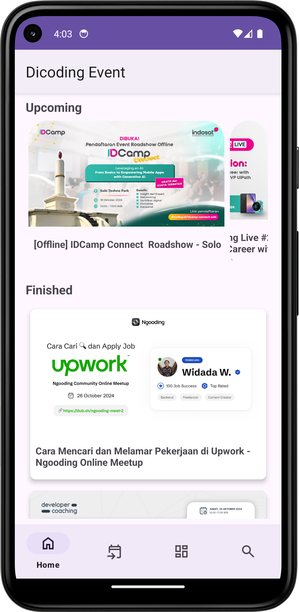
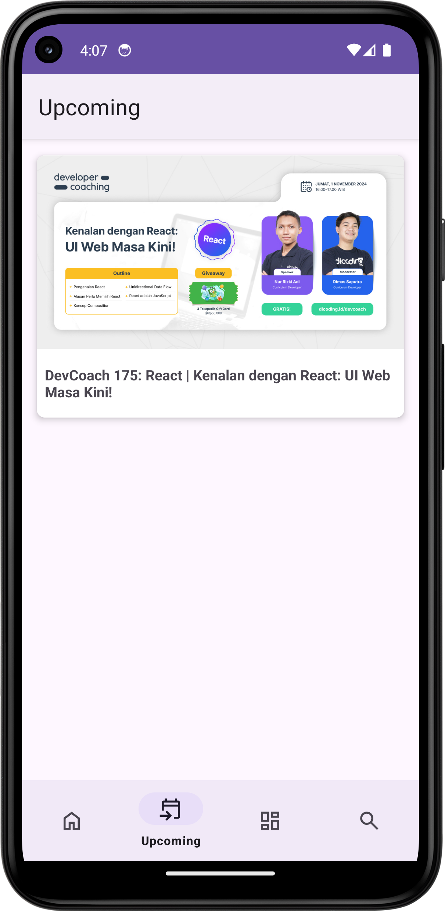
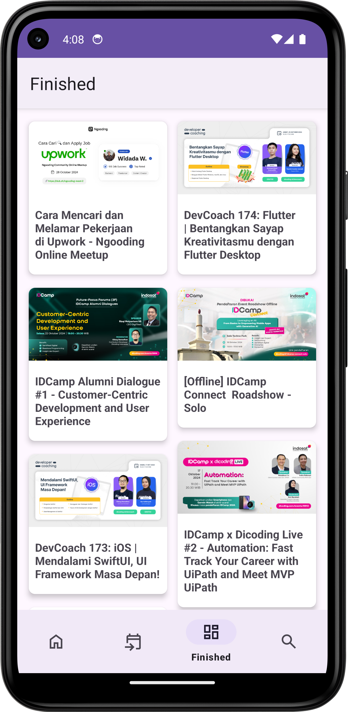
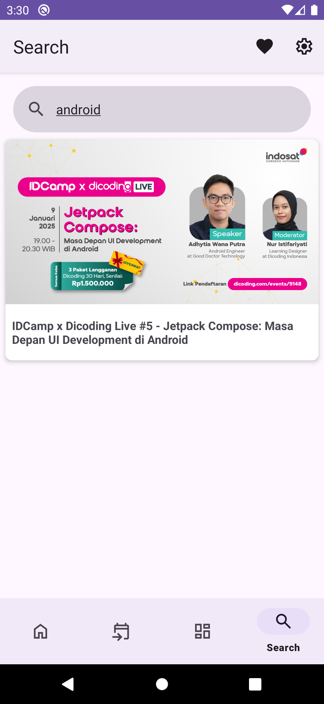
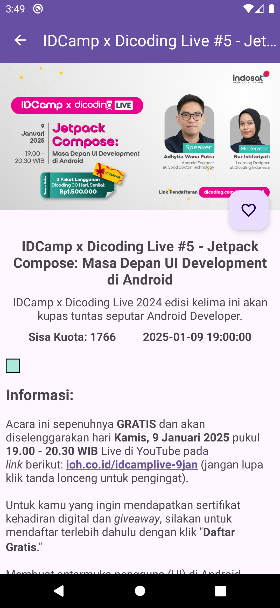

# Submission Dicoding Menjadi Android Developer Expert

## Dicoding Event App

Dicoding Event adalah aplikasi Android untuk menampilkan acara yang sedang atau telah berlangsung, lengkap dengan detail informasi acara.

## Fitur
- **Bottom Navigation**: Akses event aktif atau yang sudah selesai melalui Bottom Navigation.
    - **Home**: Menampilkan maksimal 5 event yang sedang aktif (akan datang) dalam bentuk Carousel. Menampilkan maksimal 5 event yang sudah selesai.
    - **Upcoming**: Event yang aktif/akan datang
    - **Finished**: Event yang sudah selesai.
    - **Search**: Cari event berdasarkan kata. kunci.
- **Favorite**: Simpan event favorit untuk akses cepat di masa mendatang. Event yang telah ditandai sebagai favorit akan muncul dalam daftar khusus.
- **Settings**
  -**Notification**: Atur pemberitahuan untuk event tertentu agar tidak melewatkan acara penting.
  -**Dark Mode**: Ubah tema aplikasi ke mode gelap untuk pengalaman yang lebih nyaman di lingkungan minim cahaya.
- **Detail Event Lengkap**: Tampilkan informasi acara (gambar, nama, ringkasan, waktu, kuota tersisa, deskripsi, link acara).
- **Loading Indicator**: Loading saat pengambilan data dari API.

## Tech Stack
- **Kotlin**: Bahasa utama.
- **Coroutines & Flow**: Async & reactive.
- **Koin**: DI sederhana.
- **Clean Architecture**: Layer terpisah.
- **Modularization**: Fitur modular.
- **Dynamic Feature Module**: Fitur on-demand.

## Screenshots

    
    
    
    
    

## Closing
Feel free to clone this repository as an example to help you code!  https://github.com/kibar78/Submission-Menjadi-Android-Developer-Expert/tree/master

#### Author
Rizki Akbar (kibar78)
