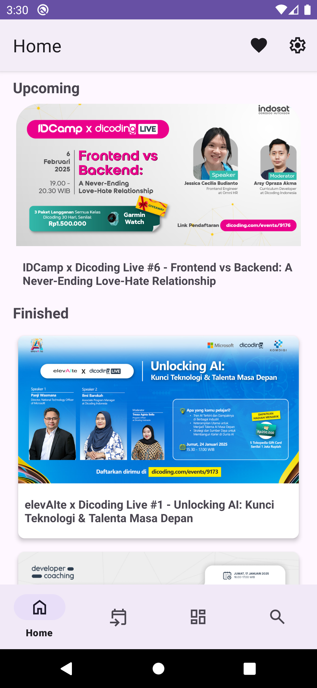
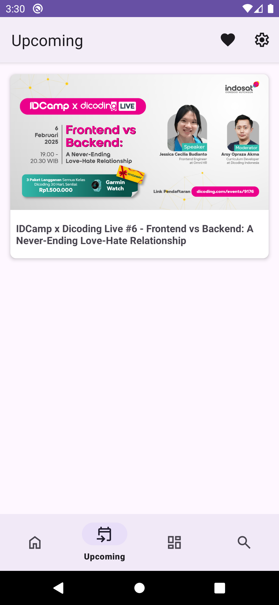
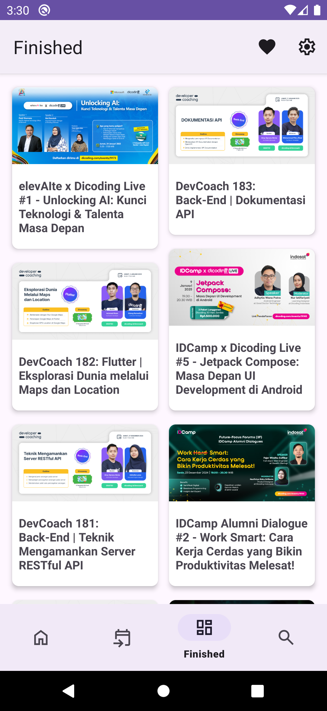

# Submission Dicoding Belajar Fundamental Aplikasi Android

Submission Awal Untuk Kelas Dicoding Belajar Fundamental Aplikasi Android (BFAA). 

## Dicoding Event App

Dicoding Event adalah aplikasi Android untuk menampilkan acara yang sedang atau telah berlangsung, lengkap dengan detail informasi acara.

## Fitur
- **Bottom Navigation**: Akses event aktif atau yang sudah selesai melalui Bottom Navigation.
    - **Home**: Menampilkan maksimal 5 event yang sedang aktif (akan datang) dalam bentuk Carousel. Menampilkan maksimal 5 event yang sudah selesai.
    - **Upcoming**: Event yang aktif/akan datang
    - **Finished**: Event yang sudah selesai.
    - **Search**: Cari event berdasarkan kata. kunci.
- **Detail Event Lengkap**: Tampilkan informasi acara (gambar, nama, ringkasan, waktu, kuota tersisa, deskripsi, link acara).
- **Loading Indicator**: Loading saat pengambilan data dari API.

## Screenshots

    
    
    
    
    

## Closing
Feel free to clone this repository as an example to help you code!  https://github.com/kibar78/Submission-Belajar-Fundamental-Aplikasi-Android.git

#### Author
Rizki Akbar (kibar78)
